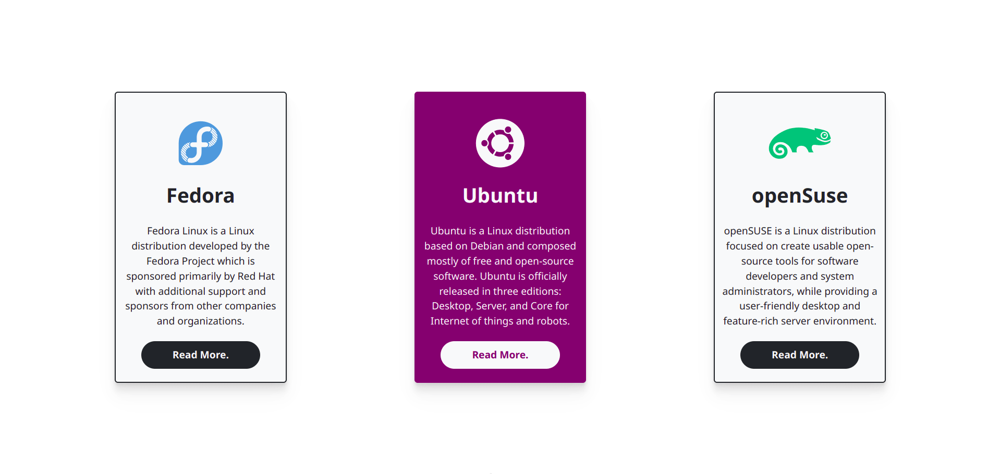

## CSS: Detail Cards

This project is a simple study of some Detail Cards made with HTML/CSS in order to share my top 3 favorite Linux Distributions.

## Licence

This repository is released under the [**MIT License**](LICENSE).

## From me to you

Hi, my name is **Felipe!**

I'm a Front-End student who wants to share my learning with the community, helping other devs in the same situation.

At the moment I'm studying by myself in 💻 online courses, 📄 reading the documentation, and 💪 hard practicing every day. So if I can, **you could too!**

I hope you've enjoyed this repository and have helped you in some way.

Thanks for checking out and have good learning 😉"

## Contributors

[feliperdamaceno](https://github.com/feliperdamaceno/)

## Contact me

Linkedin: [feliperdamaceno](https://www.linkedin.com/in/feliperdamaceno/)
